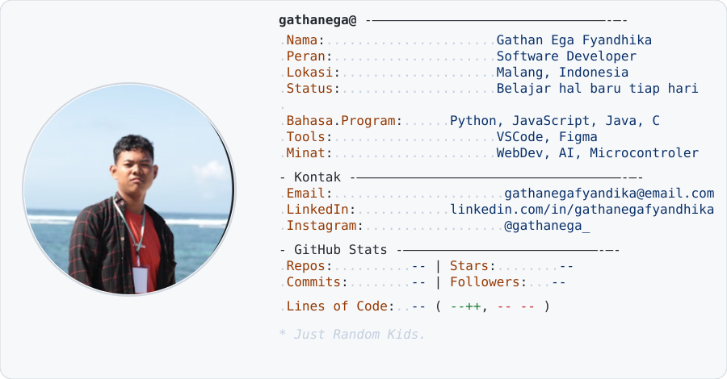

<a href="https://github.com/gathanega/gathanega"> <picture> <source media="(prefers-color-scheme: dark)" srcset="dark_mode.svg">  </picture> </a>   
  
 <picture> <source media="(prefers-color-scheme: dark)" srcset="https://raw.githubusercontent.com/gathanega/gathanega/output/github-contribution-grid-snake-dark.svg">  </picture>
 
